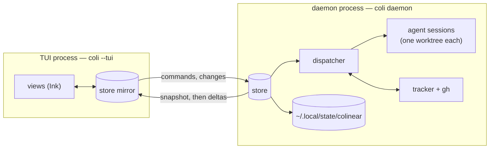
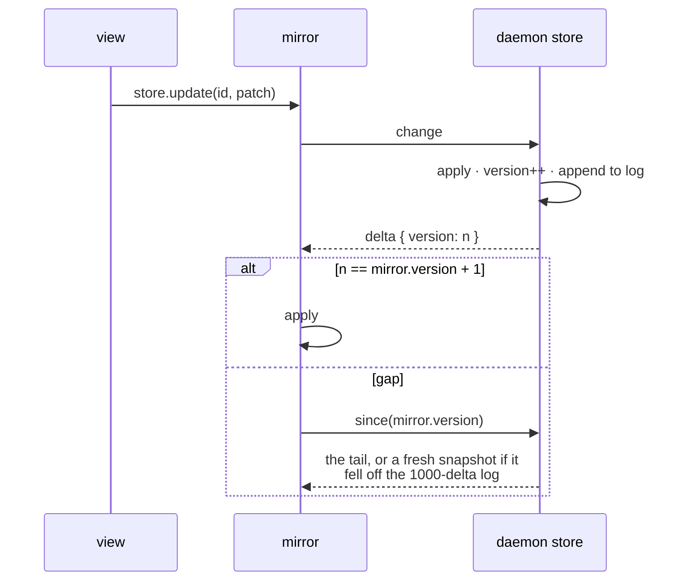
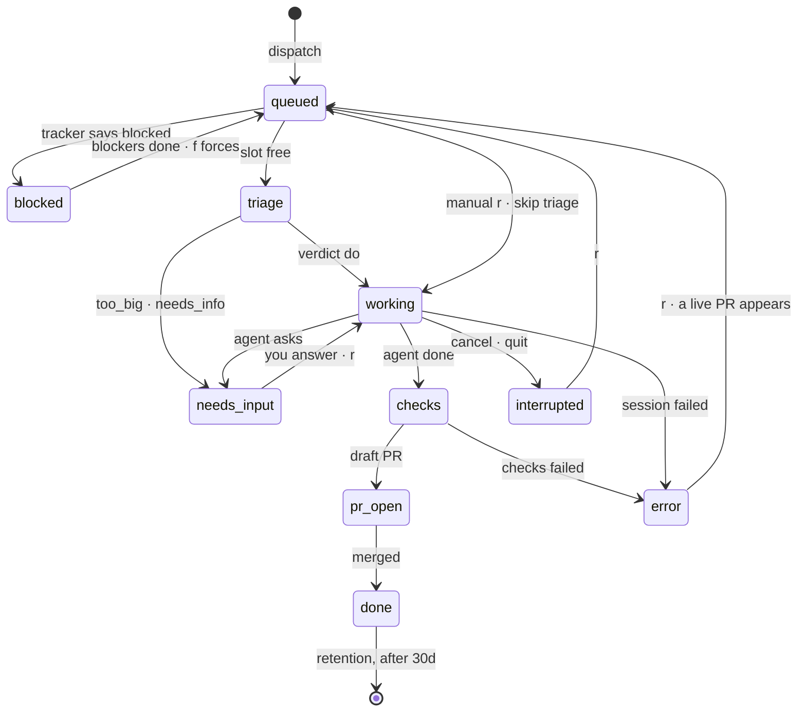

# colinear — design notes

## What it is

A k9s-style Ink TUI that dispatches Claude Code agents (via `@anthropic-ai/claude-agent-sdk`) against Linear issues. One git worktree per issue, kanban board of agent progress, draft-PR-only output, human-in-the-loop for questions/escalations/promotion. Runs on Claude subscription auth: the SDK uses the logged-in `claude` CLI when `ANTHROPIC_API_KEY` is unset — never set that env var here.

Stack: TypeScript (strict, NodeNext ESM — all internal imports use `.js` suffixes), React 18 + Ink 5, no test framework. `npm run dev` = tsx; `npm run build` = tsc → `dist/` (`coli`/`colinear` bins via `npm link` run dist, so **rebuild after changes**).

## How it works

Two processes, one authoritative store, and a mirror that is never allowed to lie. (File-by-file map: [CODEMAP.md](https://github.com/jubrad/colinear/blob/main/CODEMAP.md).)



The **daemon** owns everything stateful: the dispatcher, the store, persistence, PR polling and the
tracker sweeps. Agents therefore outlive the terminal — close it, `q`, or `R` onto a new build and
the work keeps running. `coli daemon stop` is the only thing that interrupts an agent.

The **TUI** is a client. It hydrates a mirror of the store and follows changes. `coli` starts both,
the daemon only if one isn't already listening on the context's socket.

The split is deliberately invisible to views:

| | |
|---|---|
| **Reads** | the mirror is a `Store` with the same API — `useTasks()` and `store.get()` don't know |
| **Writes** | `store.update()` on a mirror **forwards** and applies nothing locally; the authoritative delta comes back |
| **Callbacks** | `question.answer` can't cross a socket, so the mirror synthesizes one that sends `{answer, id, text}`; the real closure lives in the daemon |
| **Decisions** | anything that depends on what re-polling finds (`applyEdits`, promotion gates) is a dispatcher method, not view logic |

The rule that keeps it honest: **a mirror never mutates itself.** One local write that isn't
echoed by the daemon and the two copies disagree forever, silently.

### The mirror follows a log, not a feed

State reaches the client by change data capture. Every mutation stamps a delta with the version it
produced, so the client can tell "I have everything" from "I missed something" — a distinction a
plain event feed can't make.



`npm run check` (`bin/check`) replays a recorded delta stream into a fresh mirror and asserts it
matches the daemon's store field for field. That replay is the only test in the repo, and it exists
because divergence here is invisible until someone acts on a stale card.

### Clocks

Nothing polls on render. Every recurring read lives in the daemon on a fixed timer:

| every | what runs | why that number |
|---|---|---|
| 2s | the running task's subtask checklist file | it drives a progress bar; the agent rewrites it mid-turn |
| 60s | PR state, CI rollup, review decision, mergeability | GitHub's own numbers move on this order; faster mostly buys rate limits |
| 60s | blocked recheck, retention sweep, closed-issue sweep, sub-issue rollup | one tick, four jobs — see `recheckBlocked()` |
| 5m | `gh` search for PRs awaiting your review | a review request is not urgent, and the search is expensive |

Two retries also sit on clocks: a session that dies before starting is requeued once after **5s**,
and a rate-limited session after **30s**. Both are one-shot — a second failure parks the task rather
than looping.

The blocked recheck is also **event-driven**: it runs whenever a task completes or a PR merges, so a
dependency clearing doesn't wait out the minute.

### The task state machine



Concurrency is the whole scheduler: `pump()` starts tasks while `running < concurrency` and refills
as each finishes. There is no priority queue — the board's ordering is a view concern.

Three states sit outside that flow:

- **`tracking`** — a parent whose work happens in its sub-issues. It never runs a work session; the
  60s sweep rolls its children up, and `M` or `r` starts a *coordinator* session instead (no
  worktree, no checks, no PR).
- **Manual dispatch** — `awaitingStart`. The worktree exists and the card sits in Working with
  nothing running, waiting for you to lay a skeleton down. `r` hands that same worktree to an agent.
- **Maintenance** (`fixci`, `rebase`) — runs against an already-open PR. The task keeps its status
  and shows a blinking dot rather than moving back to Working: the feature isn't being rewritten.

## Experiments

Features that work but aren't settled sit behind two flags: `experimental` (master) and
`experiments.<name>`. `experimentOn(cfg, name)` is the only way to ask; both must be true.
Two switches rather than one because the master is how you turn everything off at once
after a bad session, without losing which features you'd chosen. A feature named while the
master is off, or a name that isn't an experiment, is logged — an experiment that silently
doesn't run wastes an afternoon.

`EXPERIMENTS` in types.ts is the registry (name → one-line description); adding a feature
means adding a key there, gating it with `experimentOn`, and documenting it in README's
experiments table. Experimental views stay registered when disabled and explain how to turn
themselves on — a `:chan` that says "unknown view" teaches nothing.

Live experiment: **coordination channels** (COORDINATION.md). Worth knowing structurally:
the agent tools are an in-process MCP server built per session with the channel and username
closed over, so identity can't be spoofed by prompt; the message log lives in the state dir
and is written by the daemon, which is why the TUI polls it and sends operator posts back
over the socket instead of appending itself.

## Contexts

A context is a config file plus a state directory, and because the socket lives in that directory
it is also a whole separate daemon — two contexts can run at once and neither sees the other's
tasks. `--context work` / `-c work` / `COLINEAR_CONTEXT=work` select one; the default context keeps
the historical paths exactly.

Two constraints shaped the implementation:

- **Resolution has to happen before any path is derived.** `STATE_DIR` and `SOCKET_PATH` are
  module-level constants, and ESM evaluates imports before the importing module's body — so
  parsing argv in index.tsx would be too late. `core/context.ts` is a leaf module that resolves at
  its own evaluation time and everything path-shaped imports it.
- **Children must inherit it.** Rather than thread a flag through the supervisor's TUI spawn and
  the client's detached daemon spawn, resolution sets `COLINEAR_CONTEXT` in `process.env` when the
  context isn't default. Every spawn site inherits the environment and stays unaware contexts exist.

Config layering is one shallow merge of the context file over the base config (`{...base, ...ctx}`),
so shared settings are written once and top-level keys replace wholesale — a context that sets
`repos` gets exactly those. A named context with no file is a hard error rather than a fallback to
the default: dispatching agents into the wrong workspace is not a recoverable mistake. So is a
config file that exists and doesn't parse, which used to fall through to built-in defaults and run
against `~/work/cloud` with none of your settings.

Constraint on the UI side: every view sizes its panes against a **four-row header**
(`ctx.size.rows - 12` and friends), so the context indicator rides on the existing Repo row rather
than taking a fifth.

## Lifecycle detours

The diagram above is the shape. These are the parts that surprise people:
- `blocked` (Linear blockers open; rechecked every 60s + on merges/completions). Linear has one
  kind of "blocks"; colinear has two. A blocker starts as `start` (parks the task); `f` converts
  it to `merge`, which dispatches the work in parallel but keeps it on the task — the agent's
  prompt says what it is building ahead of, and `d` refuses to promote the PR until the blocker
  lands. Deployment is outside what colinear can see, so `D` overrides.
- `needs_input` (agent AskUserQuestion, or too_big/needs_info triage verdicts — split-plan review lives here)
- `interrupted` (restart/suspend/attach; `r` resumes the SDK session by id)
- `error` (failures; auto-unfails if a live PR turns up), `escalated` (legacy; verdicts now park as needs_input)
- new sub-issues: the tracking sweep dispatches ones nobody has started when `autoDispatchSubs`
  is on for that parent (or globally). `autoDispatchable()` is the whole rule and is pure —
  the Linear state, not the absence of a task, is what makes a sub-issue eligible, so a task
  dropped by retention long after it finished can't be resurrected. Capped per sweep
- `coordinate` mode: the coordinator's tools can message and cancel its *own* sub-issues and
  propose new ones; creating them stays behind the operator's `A`, the same review UI a too_big
  split uses
- maintenance modes leave the repo's checks to the prompt rather than re-running them here, which
  would flip the card to `checks` for no new signal
- fixci mode: red PR rollup → resume session with failing logs, one attempt per red, re-arms on green
- rebase mode: PR conflicts with its base → session that rebases and force-with-leases, same
  one-attempt-per-conflict shape. `mergeable: UNKNOWN` means GitHub is still computing and never
  triggers one. The prompt confines it to the rebase: resolve, test, push, no scope changes,
  AskUserQuestion when a conflict needs a human decision

## Sessions and messages

Work sessions are **streaming-input** conversations (`SessionInbox`): the prompt is an async
iterable that yields the opening prompt and then whatever the operator sends with `M`. The catch
is termination — a streaming session waits for more input instead of ending, so `runSession`
closes the stream when a `result` arrives with nothing pending. Miss that and every task hangs
forever. Triage keeps a plain string prompt: it is short, structured-output, and nobody needs to
message it. Messages for a task with no live session are stored on `task.inbox` and rendered into
the next session's opening prompt — and, unless the operator said otherwise, `Dispatcher.wake()`
queues the task so that session happens now. Waking deliberately skips `blocked` (a message is
not a reason to jump a dependency), `tracking` and already-queued tasks, and it pushes onto the
queue like `resume()` rather than going through `enqueue()`, so no Linear state moves.

Delivery is best-effort in one specific way worth knowing: the SDK pulls from the input stream as
soon as something is yielded, long before the agent acts on it, so a pushed message is only
*certainly* delivered once a turn completes behind it. `SessionInbox` tracks that window as
`inFlight`, clears it on each `result`, and hands anything still open back to the task when the
session ends. The bias is towards repeating a message rather than losing one.

Sessions are Claude Code sessions keyed by worktree cwd (`~/.claude/projects/<encoded-cwd>/<session-id>.jsonl`). colinear stores only the session id + worktree; interactive attach (`claude --resume`) and headless resume share the same transcript.

## PR review

A second entity beside tasks, with the same CDC contract (`review-*` deltas, keyed
`owner/repo#number`). `gh` search finds PRs awaiting my review every 5 minutes; `r` checks the
PR's head out in `<repo>-worktrees/review-<n>` and runs one session.

**The document is the artifact.** The agent writes `.colinear-review.md` (git-excluded) —
prose for the operator, ending in a ```findings fence holding a JSON array. Findings are
parsed from that fence, so a chat turn that changes the agent's mind can't leave prose and
findings disagreeing; structured output would have needed a second pass to keep them in sync.
The closing fence is found by parsing, not by regex: the block ends at the first ``` where the
JSON is valid, because a finding whose comment carries a fenced code suggestion puts a ``` in
the middle of a string — a non-greedy match ended there once, and a full review posted empty.
The daemon watches the file, so it fills in as it's written and picks up edits made anywhere.

**Posting is deterministic — no session.** The findings are already structured, so colinear
clears any pending review of ours (GitHub allows one per user per PR, and a leftover blocks
every new one), then calls `gh api` itself. An agent posting could finish happily with the
`gh` call inside it having failed; this can't. Approve and request-changes are the same call
with a different event, so a verdict carries the written review.

What reaches GitHub is deliberately small, because the document is written for the operator
and none of it belongs on someone else's PR:

- **inline comments** — one per finding with a `file` and a `line`
- **the body** — the lead finding (no file/line/severity, one sentence), a count by severity,
  an `## Other` section for findings with no line, and the operator's `n` note
- `prSignoff` / `prSignoffScope` append an attribution to all of that, or just the body

Findings survive missing fields: no `line` or no `file` means the body rather than the bin;
only a missing `comment` drops one. A line outside the diff makes GitHub reject the whole
review, so the post retries once with everything in the body.

## Project plans

A third entity beside tasks and reviews, same CDC contract (`plan-*` deltas, keyed by project id).
It is the review-document pattern with the storage **inverted**: there, colinear owns the file and
GitHub gets a deliberate posting; here the **tracker owns the design** — a project document named
`Design`, falling back to the project's description — and the file under `plans/` is a draft
workspace. Reopening always pulls the tracker's copy fresh, because someone else may have edited it.

**Nothing starts on open.** The view pulls the doc and waits. Planning is a conversation, and the
first move is the operator's — the agent leading with a finished design makes the operator a
reviewer of its ideas, which is the opposite of the point. Two ways in, one conversation:

- `c` cuts a worktree, mints a session id (`claude --session-id`) and hands the terminal to a real
  interactive session, primed with the project, its issues and the published design.
- the chat box runs the same session headlessly, a turn at a time.

The id is minted rather than discovered, which is what lets those two be the same conversation.
Once a plan has a worktree **every** session for it runs there: Claude Code files transcripts per
directory, so a resume from anywhere else silently finds nothing.

**The fence is scaffolding, not content.** The draft is prose ending in one ```plan fence
(milestones, issues, `blockedBy` by sibling title) parsed by the same parse-don't-regex rule the
review doc uses. Publishing strips it: machine JSON does not belong in a document teammates read.
The fence dissolves into tracker objects at approval instead.

**Two gates, two decisions.** `U` publishes the prose; `A`/`D` approve the fence. Both refuse
rather than guess:

- Publish compares the tracker's `updatedAt` against the revision the draft was cut from and
  refuses when it moved — overwriting a teammate blind is how a shared doc loses work.
- Approval is **reconciliation**: milestones first (by name), then issues missing from the project
  (by title), skipping what exists and *listing* what the plan no longer mentions without
  cancelling it. Cancellation stays a per-item operator keypress. `D` dispatches wave 1 — issues
  with no in-plan blockers — and the blocked-recheck sweep pulls later waves as those land.

**Outside edits are noticed, never absorbed.** The review poll also compares each planned project's
mirrored `docUpdatedAt`. A change must survive one quiet sweep (Linear saves continuously while
someone types) before it raises an activity line, a toast, and — coordination on — a deterministic
notice to the project channel as the identity `colinear`. The announced revision lands in a
separate `docSeenAt`: noticing an edit must not disarm the publish guard. No agent is woken; live
sessions finish on the brief they started with and read the channel at their pre-PR checkpoint.

Plans never leave the store on their own — retention drops finished tasks and settled reviews, but
a plan is a conversation the operator can return to, so only they remove one. `:gc` spares a live
plan's worktree for the same reason and offers it once the plan is gone.

## Issue providers

Everything above `core/provider.ts` is tracker-agnostic; everything below it is one adapter.
`providerFor(cfg)` returns the instance for a config (cached per config object, so a
`reloadConfig` that mutates in place keeps working), and nothing outside `providers/` imports a
tracker's client.

Features ask `capabilities` rather than assuming: `workflowStates` gates stateSync, `blockers`
gates the blocked column and `f`, `subIssues` gates tracking parents and `u`, `priority` gates the
PRI column, `projects` gates `:projects`, `createProjects` gates its `n`, `comments` gates escalation, and `branchNames` decides
whether the provider supplies a branch or `safeBranch()` derives one. A missing capability turns a
feature off where the operator can see it (`:config` lists them), which is the difference between
a tracker that isn't supported and one that is supported partially.

The types are the contract: `Issue`, `Scope` (team/project/repo), `Project`, `StateType`
(`backlog | unstarted | started | completed | canceled | triage`). Providers map their own
vocabulary into `StateType` — anything unrecognized becomes undefined rather than a state nobody
handles.

## Retention

Nothing left the store until `retentionDays` (default 30): done and cancelled tasks and settled
reviews are dropped by a sweep on the 60s tick, which is also the window the header's token and
cost figures cover — a total over "everything colinear has ever seen" answers no question anyone
has. Anything live, questioning, erroring or PR-open is never touched, however old.

That needed the store's first delete: `delete` / `review-delete` deltas, so a mirror drops the row
instead of keeping a ghost the daemon has forgotten.

## Disk

A worktree is a full checkout: materialize is ~30G each, and one accumulates per task and
per PR reviewed. Nothing reclaimed them until `coli gc` / `:gc`, which is why 249G had piled
up by the time this was written.

Three sources: finished tasks (kept for a window — a worktree is exactly what you want the
day a task completes), review checkouts (released when the review goes stale, meaning the PR
merged, closed, or someone else took it — *not* when it's posted, since the author may push
again), and orphans (repo re-routes and removed tasks leave directories no task claims).

Removal reports per worktree as it goes (a 60G tree is not instant) and only counts one as reclaimed once the directory is actually gone. The daemon removes them so the store's pointers get cleared in the same step; `coli gc` reads
state.json directly so it also works with the daemon down. Both refuse to report orphans when
the task list is empty — that state is indistinguishable from "state failed to load", where
every live worktree looks dead.

## Prompts

All agent-facing text lives at the bottom of dispatcher.ts. `taskContext()` renders the shared context block (issue+description+parent, repo/remotes/branch, PRs with pin markers, triage verdict/plan, operator instructions) and heads every work/resume/fixci prompt. Invariants encoded in prompts: draft PRs only (`gh pr ready` forbidden — human presses `d`), adopt existing PRs (never duplicate), subtask checklist file `.colinear-subtasks.md` (git-excluded per worktree, polled every 2s onto the card), verification tiers, fork-workflow rules.

## Testing strategy

No unit tests (deliberate for now — UI-heavy, fast-moving). The verification loop is:

1. `npx tsc --noEmit` — must be clean before every commit. **Ignore editor/LSP diagnostics in this repo; they are chronically stale — trust tsc.**
2. `npm run build` — refreshes dist so the linked `coli` binary picks up changes.
3. `npm run check` — CDC replay: mirror must match the source store exactly.
4. Smoke boot: `LINEAR_API_KEY=lin_api_dummy script -q /dev/null timeout 5 npm run dev >/dev/null 2>&1` → it rendered if you see board chrome. Ignore the exit code: macOS `script` doesn't propagate its child's status, so it is not evidence of anything. Note this now *starts a daemon* against your real config and state — `coli daemon stop` afterwards, and don't enqueue fake issues into a daemon holding live state.
5. Real verification is dogfooding against the live Linear workspace; `~/.local/state/colinear/colinear.log` catches runtime errors and diverted stderr (React warnings land there — check it when behavior is weird).

If adding tests someday: core/ is mostly pure-ish and dependency-injectable (store is a singleton — the main obstacle); prs.ts matching and dispatcher redispatch/adoption logic are the highest-value targets.

## Rendering gotchas (hard-won — do not relearn these)

- **A pane that overflows by one row loses its title.** Ink paints the overflow over the first
  line rather than clipping the last, so a fixed-height pane must slice its content to
  `height - borders - header rows`. Both panes of the review modal hit this the moment an
  error line appeared above the doc.
- **A question is a set, not a string.** `PendingQuestion` holds every question the agent asked
  (1–4) with per-option descriptions, and `answer` takes an array in the same order. The wire
  format carries the set minus the callback, which the mirror rebuilds; `npm run check` asserts a
  two-question set with descriptions survives the round trip.
- **An empty `<Text>` has no height**, so blank lines vanish and markdown paragraphs run
  together — render `' '` for them.
- **Edits are popups; whole surfaces are full screen.** Anything that edits a thing — the task
  form, custom dispatch, the answer form, the sub-issue picker, messaging an agent — floats over
  the view it was opened from via `Popup`, because the context you are editing against is worth
  keeping on screen. Full screen is for surfaces rather than edits: `:config`'s `$EDITOR` handoff,
  the PR review doc + discussion split. A one-line y/n confirmation (`:gc`, review posting) is
  neither — it stays inline at the foot of its view.
- **Modals are popups, and two things make that work.** Ink supports `position="absolute"`, so
  `Popup` (ui/Popup.tsx) floats a dialog over the view instead of displacing it — but Ink only
  writes cells that hold characters, so an absolute bordered box is **transparent**: the board
  shows through every gap between its own words. Hence the backdrop, an explicit block of spaces
  at the same coordinates drawn first. And **absolute boxes paint in tree order**: a popup
  rendered before its siblings is silently overdrawn by them, so it goes last in the view.
  Height is passed in rather than measured (yoga lays out after we'd need it); overshooting just
  makes the dialog roomier, undershooting clips it, so callers round up.
- **A view's vertical budget is `rows - 8`** (`- 4` more while the command bar is open): the
  app pane is `rows - 4 - 2 - cmd` and its border costs 2. Anything with a fixed-height
  companion — TasksView's 15-row detail pane — has to subtract it *and* the table's own header
  and count rows, and drop the companion when what's left is unreadable.

- **Ink full-clears every frame when output height ≥ terminal rows (equality included).** Root box renders `rows - 1` lines, `overflow="hidden"`, fixed heights on panes. Violate this and the app "vibrates".
- **Identity stability is load-bearing.** useTasks memoizes per store.version; BoardView's cursor-clamp effect returns the same object when unchanged. A fresh-array-every-render regression once caused an infinite render loop that looked like terminal flicker (React "Maximum update depth" — found via the stderr diversion).
- Frames are wrapped in DEC 2026 synchronized-output guards (index.tsx) so supporting terminals paint atomically; stderr is diverted to the log while the TUI owns the screen; the clock stops when nothing is timing. All three exist to kill flicker — keep them.
- Avoid ambiguous-width glyphs (⎈ ？ etc.) in always-visible chrome: terminals render them 2 cells, Ink counts 1, lines wrap, height overflows.
- **An empty needle used to fuzzy-match everything.** `fuzzyMatch(x, '')` returned true on the first
  character (`i === needle.length` is `0 === 0`), so a bare `:plan` resolved to whatever project came
  back first — and started a planner agent against it. Empty now means no match; callers that mean
  "no filter" special-case it themselves.
- Key input: views gate their useInput with `isActive` (modals/bars/cmdOpen); AppCtx.setCapture disables global keys while text inputs own the keyboard; setEscHandler lets a view consume esc (clear filters) before the stack pops.

## State & files

| what | where |
|---|---|
| config | `~/.config/colinear/config.json` |
| contexts | `~/.config/colinear/contexts/<name>.json` (layered over the config above) |
| custom views | `~/.config/colinear/views/*.json` |
| task/review/plan/UI state | `~/.local/state/colinear/state.json` (pruned by `retentionDays`; plans only leave when the operator removes them) |
| plan drafts | `~/.local/state/colinear/plans/<project>.md` (workspace only — the tracker's document is the source of truth) |
| debug log + diverted stderr | `~/.local/state/colinear/colinear.log` |
| coordination channels (experimental) | `~/.local/state/colinear/channels/*.jsonl` + `cursors.json` |
| socket + pidfile | `~/.local/state/colinear/coli.sock`, `coli.pid` |
| attach scripts | `~/.local/state/colinear/attach-*.sh` |
| worktrees | `<repo>-worktrees/<ISSUE-KEY>` (per repo config) |
| session transcripts | `~/.claude/projects/<encoded-worktree>/<session>.jsonl` (Claude Code's, not ours) |

Every `~/.local/state/colinear/` path above moves under `contexts/<name>/` in a non-default context;
`COLINEAR_STATE_DIR` overrides the lot (tests set it so they can't touch a live daemon's socket).

## Known hacks / debt

- AskUserQuestion answers ride back on a `behavior: "deny"` message (agent told it's not an error). SDK's `defer` mechanism is the cleaner replacement.
- store is a module singleton; version-counter subscription, not granular. In client mode the
  singleton *is* the mirror — which is what keeps views ignorant of the split, but it also means
  nothing stops daemon-only code from being imported into the client and silently mutating a mirror.
- Snapshots are whole-store; fine at this scale (activity is capped at 200 lines/task) but a diffed
  snapshot is the obvious next move if boards get big.
- Every session registers in `core/sessions.ts` from inside `runSession`, which is what `:agents`
  reads. It is a plain in-memory registry rather than a CDC entity: the client asks for the list
  while the view is open instead of following deltas, because it is a "what is happening now"
  question and nothing persists it across a daemon restart.
- `escalated` status is vestigial (verdicts now park as needs_input) but kept for old persisted state.
- Interactive attach + headless resume share one session id; concurrent writers are prevented by suspend-first, not enforced.
- No pagination UI past the 500-issue cap; silently truncates.
- Commit style: imperative subject, body explains why, `Co-Authored-By: Claude <model> <noreply@anthropic.com>`; typecheck+build before committing; push to origin main after committing.
