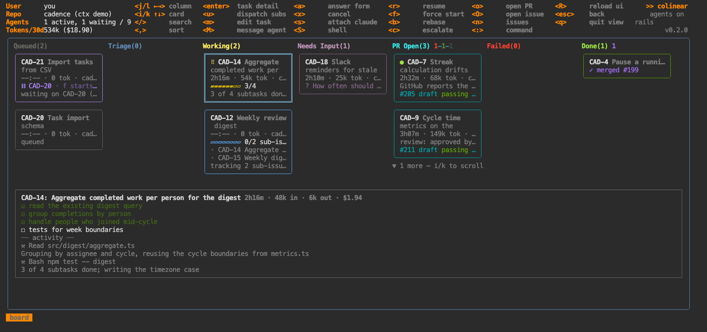
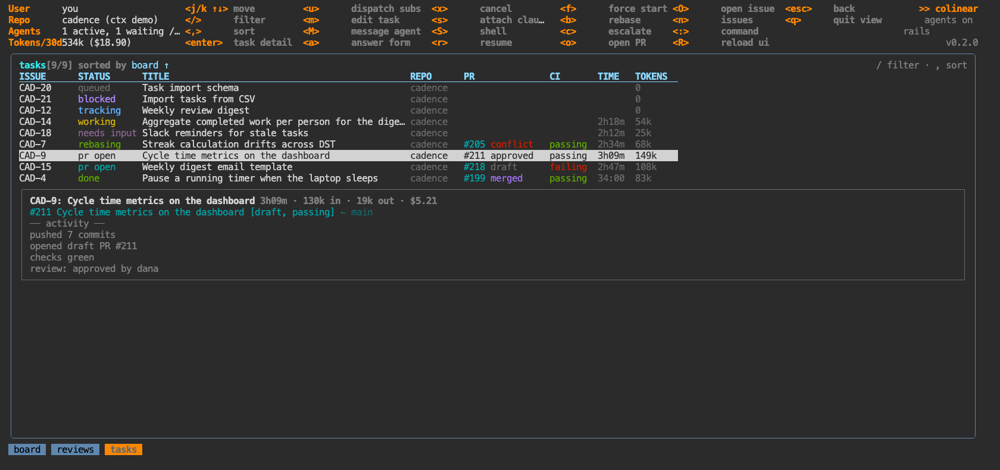

# colinear

A k9s-style terminal UI that runs Claude Code agents against your issue tracker. Pick issues, dispatch an agent per issue into its own git worktree, and watch a live board of what they're doing — questions answered inline, draft PRs, CI, review state, cost.

It runs on **Claude subscription auth** (the logged-in `claude` CLI), works on **Linear** today behind a provider interface, and never touches your working copy: agents get worktrees, and they only ever open draft PRs.



Every task is also a searchable, sortable table — same data, same keys, `:tasks`:



*Both frames are `coli demo` — a fabricated board you can run yourself in thirty seconds.*

## Try it in thirty seconds

```bash
git clone https://github.com/jubrad/colinear && cd colinear
npm install && npm link
coli demo                        # a populated board — no account, no agents, nothing billed
```

## Quick start

```bash
git clone https://github.com/jubrad/colinear && cd colinear
npm install && npm link          # installs `coli` on PATH
coli init                        # pick `sqlite` to try it with no account, or `linear` for the real thing
npm run doctor                   # claude CLI, gh auth, key, repos
coli                             # `?` for help, `:` to jump between views
```

Requirements: the `claude` CLI logged in (leave `ANTHROPIC_API_KEY` unset) and `gh` authenticated. A Linear API key too, unless you start with the built-in local tracker.

## What it does

- **Dispatch** — an agent per issue, in a worktree cut from your repo. Triage picks the repo and scopes the work, the work pass implements it and opens a **draft** PR. Agents never mark a PR ready; that's your keypress.
- **Watch** — a kanban board and a table view of every task: live duration, tokens, cost, subtask progress, CI and review state, blocked-by chains.
- **Steer** — answer an agent's questions in a form, message a running agent without attaching, attach to its session and hand it back, cancel, resume, rebase.
- **Review** — PRs awaiting your review get an assisted pre-review you edit and post deterministically, never by an agent.
- **Plan** — a read-only planning chat that drafts sub-issues for you to approve.

## Documentation

| | |
|---|---|
| [Getting started](docs/getting-started.md) | install, configure, first dispatch |
| [Security & blast radius](docs/security.md) | what it can touch, what it can't, where your data goes |
| [Demo mode](docs/demo.md) | `coli demo` — see it working before configuring anything |
| [How dispatch works](docs/dispatch.md) | triage → work → checks, messaging agents, sessions |
| [Configuration](docs/configuration.md) | every option, with defaults |
| [Remote daemon](docs/remote.md) · [Docker](docs/docker.md) | run the daemon on a VM or in a container *(work in progress)* |
| [CLI](docs/cli.md) | `coli`, `init`, `daemon`, `gc`, `contexts` |
| [Views](docs/views/) | one page per view — `:board`, `:issues`, `:reviews`, … |
| [Architecture](DESIGN.md) | how it works inside, and the gotchas |

## Status

Used daily by its author against a real Linear workspace; APIs and keybindings still move. Two issue providers today: **Linear**, and a **local sqlite tracker** for trying it without an account — [the interface and its capability flags](docs/configuration.md#issue-providers) are what a third one plugs into.

MIT licensed.
