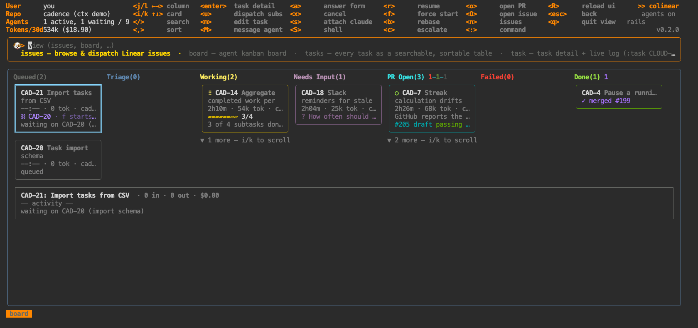

# colinear docs

- **[Demo mode](demo.md)** — `coli demo`: a populated board, no account, nothing billed
- **[Getting started](getting-started.md)** — install, configure, dispatch your first issue
- **[Security & blast radius](security.md)** — what colinear can touch, what it can't, where your data lives
- **[How dispatch works](dispatch.md)** — the triage → work → checks pipeline, messaging agents, sessions
- **[Configuration](configuration.md)** — every option and its default
- **[Remote daemon](remote.md)** — run the daemon on a VM, drive it over ssh *(work in progress)*
- **[Docker](docker.md)** — the daemon (and therefore agents) in a container *(work in progress)*
- **[CLI](cli.md)** — `coli`, `init`, `daemon`, `gc`, `contexts`, `doctor`
- **[Architecture](../DESIGN.md)** — how it works inside

## Views

`:` opens the command bar; tab completes. Most views also have a short alias.

<!-- generated: views (bin/gen-docs) -->
| view | aliases | what it's for |
|---|---|---|
| [`:issues`](views/issues.md) | `i` `is` | browse the tracker and dispatch agents |
| [`:board`](views/board.md) | `b` `bo` | agent kanban board |
| [`:tasks`](views/tasks.md) | `ls` `t` | every task as a searchable, sortable table |
| [`:task`](views/task.md) | `ta` | task detail + live log (:task CLOUD-123) |
| [`:projects`](views/projects.md) | `pj` `proj` | projects in the tracker |
| [`:project`](views/projects.md) | `p` | project kanban (:project NAME) |
| [`:plan`](views/plan.md) | `chat` | project planning chat (:plan PROJECT) |
| [`:reviews`](views/reviews.md) | `rev` `pr` | PRs awaiting my review + assisted pre-review |
| [`:costs`](views/costs.md) | `cost` `$` | spend per ticket |
| [`:logs`](views/logs.md) | `log` `debug` | live debug log (what colinear is actually doing) |
| [`:gc`](views/gc.md) | `disk` | reclaim worktree disk and finished cards |
| [`:chan`](views/chan.md) | `channel` `irc` | coordination channels (experimental — :chan CLO-67) |
| [`:config`](views/config.md) | `cfg` | view & edit colinear config |
| [`:help`](views/help.md) | `h` | views, keys, custom view schema |
<!-- /generated -->

## Global keys

| key | what |
|---|---|
| `:` | command bar — a view name, optionally with an argument (`:task CLO-142`) |
| `?` | help |
| `esc` | clear filters, then go back |
| `q` | back, or quit at the root |
| `R` | reload the frontend on new code — agents keep running |
| `ctrl+c` | quit |
