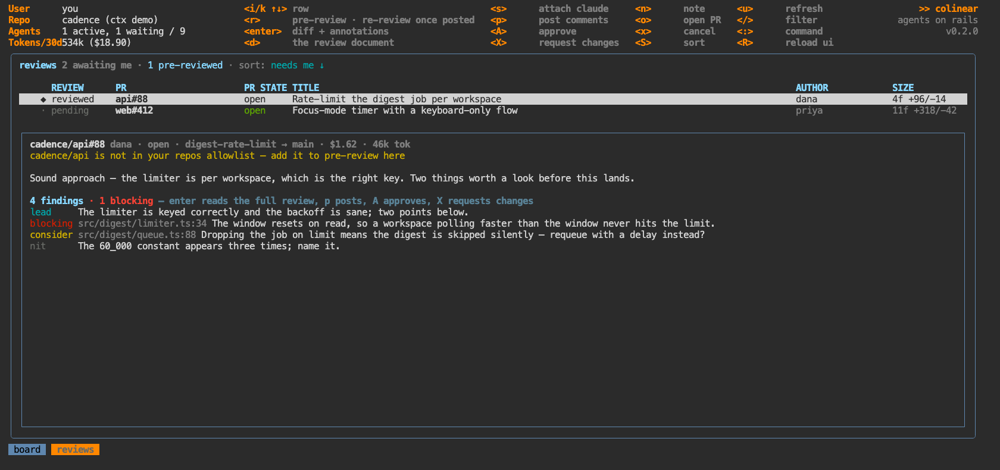

# `:reviews` — PRs awaiting your review

Aliases: `rev`, `pr`. PRs where your review is requested, across every repo your `gh` auth can see,
refreshed every five minutes.

## Assisted pre-review

`r` checks the PR out in a worktree and runs one agent over the diff in context. Progress streams
onto the card. **Nothing is posted.**

`enter` opens the **review document** full screen — the agent's write-up on one side, a discussion
with that same agent on the other (`tab` switches, `j/k` scrolls, `e` edits it in `$EDITOR`). Your
turn resumes the reviewing session, so the PR is still in context; when the agent needs a decision it
asks in the same pane.

## Posting

`p` posts, `A` approves, `X` requests changes — the same review with a different event. Posting is
**deterministic, not agentic**: the findings are already structured, so colinear clears any leftover
pending review of yours and makes the `gh api` call itself. It costs no tokens and either works or
says why.

What actually gets sent is deliberately small:

- **inline comments** — one per finding with a file and a line
- **the body** — the lead finding (no file, no line, one sentence), a count by severity
  (`1 must fix / 3 considerations / 1 nit`), an `## Other` section for findings with no line, and
  your note
- `prSignoff` appends attribution to all of that, or to the body alone

The document's prose is written for you, to decide what to send. It never leaves your machine.

## Keys

| key | what |
|---|---|
| `r` start a pre-review · `x` cancel one · `u` refresh the list |
| `enter` | the review document + discussion |
| `p` post · `A` approve · `X` request changes · `n` attach a note that rides along |
| `s` | hand the terminal to that review's claude session |
| `S` | sort: needs-me / updated / size / repo / author / cost (again reverses) |
| `o` | open the PR |

Review worktrees are reclaimed when the PR merges or the review goes stale — not when it's posted,
since the author may push again.
