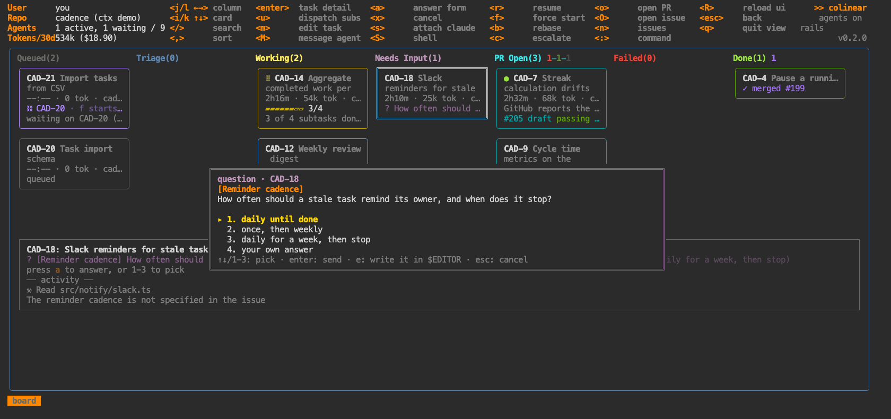

# `:task` — one task in full

Alias: `ta`. Argument: the issue key (`:task CLO-142`). `enter` from the board or the table.

Everything about one task: the scrollable activity log, subtasks, dependencies, check output, and
each PR with its draft state, CI, review decision and stack base. The header also carries the
**worktree path** and the live **session id** as a ready-to-paste `claude --resume` — the two
handles you need to poke at a session from outside colinear (the transcript lives under
`~/.claude/projects/<encoded-worktree>/<session-id>.jsonl`).

## Keys

| key | what |
|---|---|
| `j` `k` | scroll the log · `g` top · `G` follow the tail |
| `a` | answer the agent's question |
| `1`–`9` | pick an option, when there's a single question |
| `P` | review a split plan or a coordinator's proposed sub-issues |
| `d` | **mark the draft PR ready** — the only path out of draft |
| `D` | promote anyway, past an unlanded merge-order dependency |
| `s` attach claude · `S` shell · `x` cancel · `r` resume/retry |
| `o` open the PR · `O` open the issue |

## Answering questions

`a` opens a form over the view. An agent can ask up to four questions at once, each with options
that carry a description of what choosing them means:

`←` goes back to change an answer; they're sent together. **`e`** writes the whole set as a markdown
form and opens `$EDITOR` — for a paragraph, or to answer four at once. Anything left blank is sent as
"you decide".

Permission prompts (a classifier blocking a command) use the same form with allow/deny.

## Plan review

A `too_big` triage verdict returns a **split plan**: single-repo sub-issues with dependencies. `P`
reviews it — `space` drops an item, `A` creates them as sub-issues with the right blocking relations,
`D` creates and dispatches. A coordinator's proposals review the same way.
